### Application Layer

- Define key application-layer concepts
- Examine several network application in detail
- network application development

#### 2.1 Principles of Network Applications

Core of network application development is writing programs that run on different end systems and communicate with each other over the network.

For example , in Web, there are:

- the browser program running in the user's host
- the Web server program running in the Web server host

Another example, P2P: there is a program in each host that participates in the file-sharing community, the programs in the various hosts may be similar or identical


##### 2.1.1 Network Application Architectures

Distinctly different from an network's architecture.


Two predominant architectural paradigms:

- client-server architecture

  - Server: Always-on host
  - Clients: send  requests to server

  Characteristics:

  - clients do not directly communicate with each other
  - Server has a fixed, well-know address called UP address

  E.g. Web, FTP. Telnet, email

  A single-server host is often incapable of keeping up with all requests from clients. Thus, a **data center**, housing a large number of hosts, is often used to create a powerful virtual server.

- peer-to-peer(P2P) architecture 

  Minimal or no reliance on data centers, by exploiting direct communication between pairs of intermittently connected hosts, name *peers*. 

  E.g. file sharing(BitTorrent), peer assisted download acceleration(Xunlei), Internet Telephony(Skype), and IPTV(PPstream)

  Pros:

  - **Self-scalability**
  - **Cost-effective**

  Challengers:

  - **ISP Friendly**. P2P shift upstream traffic from servers to residential ISPs, while they have been dimensioned for "asymmetrical" bandwidth usage. (Downstream > Upstream)
  - **Security**. Highly distributed and open in nature
  - **Incentives**. Depends on convincing users to volunteer bandwidth, storage, and computation resources to applications.

Some have **hybrid** architectures, combing both client-server and P2P.

e.g. instant messaging applications, servers are used to track IP address of users, but user-to-user messages are sent directly between user hosts

##### 2.1.2 Process Communicating

In OS, it is not programs but **processes** that communicate.

Processes on 2 different end systems communicate with each other by exchanging messages across the computer network.


###### Client and Server Processes

A network application consists of pairs of processes that send messages to each other over a  network.

e.g. With  the  Web,  a browser is a client process and a Web server is a server process. With P2P file-sharing, the peer that is downloading the file is labeled as the client, and the peer that is uploading the file is labeled as the server.

Definition of client and server processes:

> In the context of a communication session between a pair of processes, the process that initiates the communication( that is, initially contacts the other process at the beginning of the session) is labeled as the **client**. The process that waits to be contacted to gebin the session is the **server**.

###### The Interface Between the Process and the Computer Network

A process sends message into, and receives messages from, the network through a software interface called a **socket**.

Socket is the interface between the application layer and the transport layer within a host, also referred as **Application Programming Interface(API)** between the application and the network.

Application develop control everything of the application layer-side but little of transport-layer side. Only exceptions:

1. The choice of transport protocol
2. Fix a few transport-layer parameters such as maximum buffer and minimum segment sizes 

###### Addressing Processes

In order to  identify the receiving process, need:

1. the address of the host
2. an identifier that specifies the receiving process in the destination host

In the Internet, the host is identified by its **IP address**. Due a host might be running many network applications, a destination **port number** is required. e.g. Web server is identified by port number 80, a mail server process(using SMTP protocol) is identified by port number 25. 

##### 2.1.3 Transport Services Available to Applications

Choose transport layer protocol based on 4 dimensions:

- reliable data transfer

- throughput
- timing
- security

###### Reliable Data Transfer

Packet can get lost within a computer network. A packet can overflow a buffer in a router, or can be discarded by a host or router after having some of its bits corrupted.

 If a protocol provides a guaranteed data delivery service, it is said to provide reliable data transfer. One important service that a transport-layer protocol can potentially provide to an application is process-to-process reliable data transfer. Otherwise, some of the data sent by the sending process may never arrive at the receiving process. This might be acceptable for **loss-tolerant applications**.

###### Throughput

Another natural service that a transport-layer protocol could provide, namely, guaranteed available throughput at some specified rate. Applications that have throughput requirements  are said to be **bandwidth-sensitive applications**. There are also **elastic applications**, that can make use of as much, or as little, throughput as happens to be available.

###### Timing

Timing guarantees can come in many shapes and forms.

e.g. Every bit that the sender pumps into the socket arrives at the receiver's socket no more than 100 msec later

###### Security

Finally, a transport-layer protocol can provide an application with one or more security services.

e.g. encrypting all data transmitted by the sending process, and decrypt them at the receiving process. Such a service provide confidentiality between the two processes, even if data is being observed in between.

##### 2.1.4 Transport Services Provided by the Internet


The Internet (and, more generally, TCP/IP networks) makes two transport protocols available to applications,UDP and TCP. When you (as an application developer) create a new network application  for  the  Internet,  one  of  the  first  decisions  you  have  to  make  is whether to use UDP or TCP. 

###### TCP Services

It includes a connection-oriented service and a reliable data transfer service.

- *Connection-oriented service*. TCP has the client and server exchange transport layer control information with each other **before** the application-level messages begin to flow. This so-called handshaking procedure alerts the client and server, allowing them to prepare for an on onslaught of packets,and afterwards a **TCP connection** is said to exist between the sockets of the two processes.

> **SSL(Secure Socket Layer**):TCP-enhanced-with-SSL not only does everything that traditional TCP does but also provides critical process-to-process security services, including encryption, data integrity, and end-point authentication.  When an application uses SSL, the sending process passes cleartext data to the SSL socket; SSL in the sending host then encrypts the data and passes the encrypted data to the TCP socket

Sender -> SSL -> TCP ->...->TCP->SSL->Receiver

- *Reliable data transfer service*. The communicating processes can rely on TCP to deliver all data sent **without error** and in the **proper order**. 

TCP also includes a congestion-control mechanism, a service for the general welfare of the Internet rather than for the direct benefit of the communication processes. It throttles a sending process when the network is congested between sender and receiver. It also attempts to limit each TCP connection to its fair share of network bandwidth.

###### UDP Services

 UDP is a no-frills,lightweight transport protocol, providing minimal services. It is connectionless, no handshake required.  UDP provides no guarantee that the message will ever  reach  the  receiving  process, nor the message will arrive in order. Also no congestion-control mechanism.

###### Services Not Provided by Internet Transport Protocols

Throughput and timing guarantees are bot provided by today's Internet transport protocol. It can often provide satisfactory service to time-sensitive applications, but it cannot provide any timing or throughput guarantees


###### 2.1.5 Application_layer Protocols

We have just learned that network processes communicate with each other by sending messages into sockets. But,

How are these messages structured?

What are the meanings of various fields in the messages?

When do the processes send the messages?

An **application layer protocol** defines how an application's processes, running on different-end systems, pass messages to each other. In particular,

- The types of messages exchanged,e.g., request message and response message
- The syntax of the various message types, such as the fields in the message and how the fields are delineated
- The semantics of the fields, that is the meaning of the information in the fields
- Rules for determining when and how a process send messages and responds to messages

Some application-layer protocols are specified in RFCs and are therefore in the public domain. e.g. HTTP[RFC 2616], if a browser developer follows the rules of the HTTP RFC, the browser will be able to retrieve Web pages from any Web server that has also followed HTTP RFC. Many other application-layer protocols are proprietary and intentionally not available to public.e.g. Skype.

 An application-layer protocol is **only one piece of** a network application.

##### 2.1.6 Network Applications Covered in This Book

- Web
- File transfer
- Electronic mail
- Directory service
- P2P applications


#### 2.2 The Web and HTTP

Web operates *on demand.*

##### 2.2.1 Overview of HTTP

The HyperText Transfer Protocol, is at the heart of the Web. It is defined in [RFC 1945] and [RFC 2616]. HTTP is implemented in two programs: a client program and a server client. Although executing on different end systems, talk to each other by HTTP messages. HTTP defines the structure of these messages and how the client and server exchange the message

A **Web page**(also called a document) consists of objects. An object is simply a file—such as an HTML file, a JPEG image, a Java applet, or a video clip—that is addressable by a single URL. Most Web pages consist of a base **HTML file** and several referenced object. Each URL has two components: the hostname of the server that houses the object and the object’s path name. 

e.g. the URL

> http://www.someSchool.edu/someDepartment/picture.gif has www.someSchool.edu for a host name and  <u>"/someDepartment/picture.gif"</u>  for a path name.

Because **Web browsers**(such as Internet Explorer and Firefox) implement the client side of HTTP, in the context of the Web, we will use the words *browser* and *client* interchangeably. **Web servers**, which implement the server side of HTTP, house Web objects, each addressable by a URL.

HTTP defines how Web clients request Web pages from Web servers and how servers transfer Web pages to clients.


HTTP uses TCP as its underlying transport protocol.

Client initiates a TCP connection with server -> browser and server processes access TCP through socket interfaces -> client and server send HTTP request messages and receives HTTP response messages from its socket interface

HTTP need not worry about lost data or the details of how TCP recovers from loss or reordering of data within the network. 

 HTTP server maintains no information about the clients, HTTP is said to be a **stateless protocol**. (An object sent will be sent again if requested instead of telling the receiver it is already sent).

##### 2.2.2 Non_Persistent and Persistent Connections

Should each request/response pair be sent over a `separate` TCP connection**(Non-Persistent Connections)**, or should all of the requests and their corresponding responses be sent over the `same` TCP connection**( Persistent Connections)**?

###### HTTP with Non-Persistent Connections

What happens?

1. The HTTP client process initiates a TCP connection to the server *www.someSchool.edu* on port 80(Default port for HTTP)
2. HTTP client sends an HTTP request message via its socket, the message includes the path name */SomeDepartment/home.index*
3. HTTP server process receives the request message via its sockets, retrieves the object from its storage(RAM or disk), encapsulates the object in an HTTP response message, and sends the response message to the client via its socket.
4. HTTP server tells TCP to close the TCP connection.(TCP close after it knows client received the message)
5. HTTP receives the response message and TCP connection terminates. The message indicates that the encapsulated object is an HTML file. The client extracts the file from the response message, examines the HTML file, and finds references to the 10 JPEG objects.
6. Repeat 1-4 for each referred JPEG objects.

Total response time is two RTTs + transmission time at the server of the HTML file.

Shortcomings:

- a brand-new connection must be established and maintained for each requested object

  and TCP buffers must be allocated, TCP variables must be kept in both client and server. This place a significant burden on the Web server.

- each object will suffer a longer delivery delay	

###### HTTP with Persistent Connections

The server leaves the TCP connection open after sending a response, which will only be closed when it is not used for a certain time.

The default mode of HTTP with persistent connections use pipelining.

##### 2.2.3 HTTP Message Format

HTTP request message and HTTP response message.

###### HTTP Request Message

```http
GET /somedir/page,html HTTP/1.1
Host: www.someschool.edu
Connection: close
User-agent: Mozilla/5.0
Accept-language: fr
```

First line: **request line**; subsequent lines: **header lines**.

Request line has three fields:

- the method field (GET,POST,HEAD,PUT,DELETE)
- the URL field
- the HTTP version field

Header lines:

- specify the host on which the objects resides
- specify whether the connection is persistent 
- specify the user agent
- specify the preferred language version, if not exist, return the default version


 If the value of the method field is POST, then the entity body contains what the user entered into the form fields.

The HEAD method is identical to GET except that the server MUST NOT return a message-body in the response.

The PUT method allows a user to upload an object to a specific path (directory) on a specific Web server. 

he DELETE method allows a user, or an application, to delete an object on a Web server.

###### HTTP Response Message

```http
HTTP/1.1 200 OK
Connection: close
Date: Tue, 09 Aug 2011 15:44:04 GMT
Server: Apache/2.2.3 (CentOS)
Last-Modified: Tue, 09 Aug 2011 15:11:03 GMT
Content-Length:6821
Content-Type: text/html

(data data data data ...)
```

It has three sections:

- An initial **status line**
- six **header lines**
- **entity body**

Status line had three fields:

- protocol version
- status code
- corresponding status message

Header lines:

1. going to close TCP connection after sending the message
2. indicates the time and date when HTTP response was created and sent by the server
3. the message was generated by an Apache Web server
4. indicates the time the object was last created or modified(critical for object caching)
5. number of bytes in the object being sent
6. object in entity body is HTML text


Status Code:

- **200 OK**: Request succeeded and the information is returned in the response.
- **301 Moved Permanently**: Requested object has been permanently moved;the new *URL* is specified in *Location:* header of the response message

- **400 Bad Request**: This is a generic error code indicating that the request could not be understood by the server.

- **404 Not Found**: The requested document does not exist on this server.
- **505 HTTP Version Not Supported**: The requested HTTP protocol version is not supported by the server.

The HTTP specification defines many, many more header lines that can be inserted by browsers, Web servers, and network cache servers.

##### 2.2.4 User_Server Interaction: Cookies

It is desirable for a Web site to identify users, to restrict user access, or to serve content as a function of the user identity. HTTP use cookies to allow sites to keep track of users.

Cookie technology has four components:

- A cookie header line the the HTTP response message
- A cookie header line in the HTTP request message
- A cookie file kept on the user's end system and managed by user's browser
- A back-end data base at the Web site

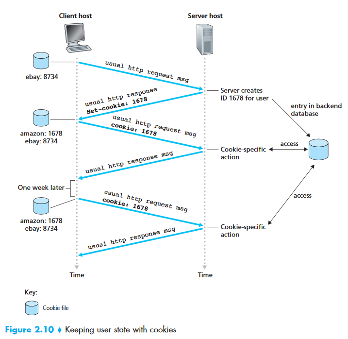

Cookies can be used to create a user session layer on top of stateless HTTP. 

*GOOD or BAD?*

##### 2.2.5 Web Caching

A **Web cache**—also called a **proxy server**—is a network entity that satisfies HTTP requests on the behalf of an origin Web server.

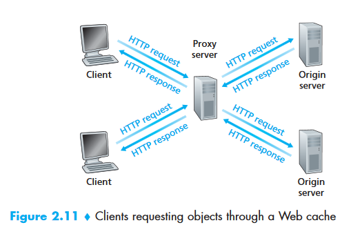

1. The browser establishes a TCP connection to the Web cache and sends an HTTP request for the object to the Web cache.
2. The Web cache checks to see if it has a copy of the object stored locally. If it does, the Web cache returns the object within an HTTP response message to the client browser.
3. If the Web cache does not have the object, it opens a TCP connection to the original server. The Web cache sends an HTTP request for the object into the cache-to-server TCP connection. After receiving the request, the original server sends the object within an HTTP response tot he Web cache.
4. When the Web cache receives the object, it stores a copy in its local storage and sends a copy, within an HTTP response message, to the client browser.

Cache is both a server and a client as the same time.

Reasons why Wen cache is deployed:

- it can substantially reduce the response time for a client request, particularly if the bottleneck bandwidth between the client and the origin server is much less than the bottleneck bandwidth between the client and the cache.
- It can substantially reduce traffic on a institution's access link to the Internet.

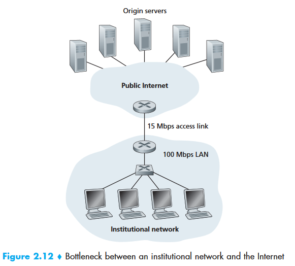

Web Cache is cheaper than upgrading bandwidth, yet provide an even lower response time than the first solution.

##### 2.2.6 The Conditional GET

To verify that its objects are up to date.

HTTP request message is a conditional GET messages if:

- the request message uses the GET method
- the request message includes an *IF-Moified-Since:header* line

Examples:

First, a proxy cache sends a request message to a Web Server:

```http
GET /fruit/kiwi.gif HTTP/1.1
HOST: www.exotiquecuisine.com
```

Second, the web server sends a response message within the requested object to the cache:

```http
HTTP/1.1 200 OK
Date: Sat, 8 OCT 2011 15:39:29
Server: Apache/1.3.0 (Unix)
Last_Modified: Wed, 7 Sep 2011 09:23:24
Content_Type: image/gif

(data data data ...)
```

The cache then forwards the object to the requesting browser but also caches the object locally. It also stores the **last-modified date** along with the object.

Third, another browser requests the same object via the cache, and the object is still in cache. Since the object may have been modified at the Web server in the past week, the cache performs an up-to-date check by issuing a conditional GET.

```http
GET /fruit/kiwi.gif HTTP/1.1
HOST: www.exotiquecuisine.com
IF-modified-since:Wed, 7 Sep 2011 09:23:24
```

Suppose the object has not been modified since 7 Sep 2011 09:23:24, then the web server sends a response message to the cache.

```http
HTTP/1.1 304 Not Modified
Date: Sat, 8 OCT 2011 15:39:29
Server: Apache/1.3.0 (Unix)

(empty entity body)
```

Note this response message has status code 304.


#### 2.3 File Transfer: FTP

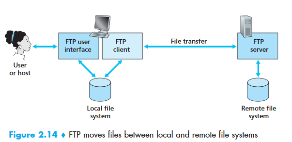

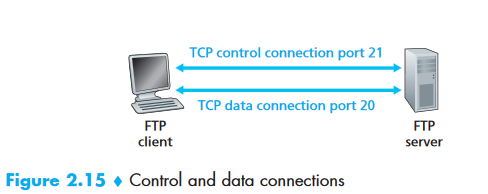

FTP uses two parallel TCP connections to transfer a file, a **control connection** and a **data connection**. It sends its control information **out-of-band** unlike HTTP & SMTP connection **in-band.**

- Control connection(port 21): send control information between hosts-such as user identification,password,command to change remote directory,commands to put and get files 
- Data connection(port 20): used to actually send a file

TCP for control connection initiated by client, TCP for data connection initiated by server.

Control connection remains open throughout duration of the user session, data connections are non-persistent.

Unlike HTTP which is **stateless**, FTP must maintain **state** about he user. E.G. must associate the control connection with a specific user account, and the server should keep track of the user's current directory and its own directory the users wanders.

##### 2.3.1 FTP Commands and Replies

Commands:

- USER user-name: send user identification to the server
- PASS password: send user password to the server
- LIST: ask the server to send back a list of all files in the current remote directory. It is sent over a new and non-persistent data connection
- RETR filename: used to retrieve a file from the current directory of the remote host. It cause the host to initiate a data connection and to send the requested file over the data connection
- STOR filename: store a file into the current directory of the remote host 

Replies:

- 331 Username OK, password required
- 125 Data connection already open; transfer starting
- 425 Can't open data connection
- 452 Error writing file

More to refer to RFC 959.

#### 2.4 Electronic Mail in the Internet

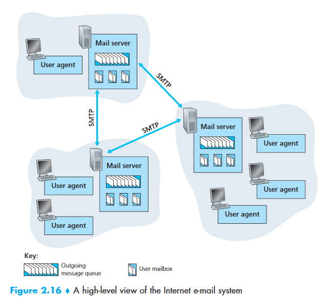

Three major components:

- user agents
- mail servers
- Simple Mail Transfer Protocol(SMTP)

SMTP is the principal application-layer protocol for Internet electronic mail. When a mail server sends mail to other mail servers, it acts as an SMTP client; when a mail server receives mail from other mail servers, it acts as an SMTP server.

##### 2.4.1 SMTP

port 25

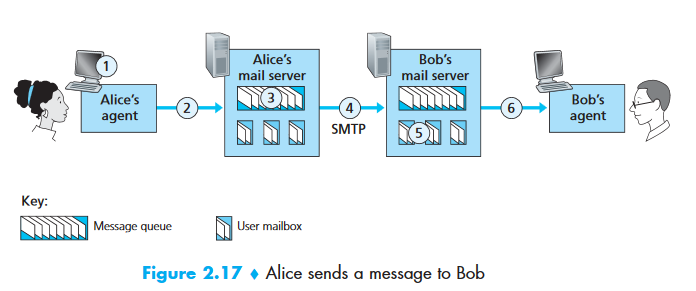

1. Alice invokes her user agent for e-mail, provides Bob's e-mail address, composes a message, and instructs the user agent to send the message
2. Alice's user agent sends the message to her mail server, where it is placed in a message queue
3. The client side of SMTP, running on Alice's mail server, sees the message in the message queue. It opens a TCP connection to an SMTP server , running on Bob's mail server
4. After some initial SMTP handshaking, the SMTP client sends Alice's message into the TCP connection
5. At Bob's mail server, the server side of SMTP receives the message. Bob's mail server then places the message in Bob's mailbox
6. Bob invokes his user agent to read the messages at his convenience

The TCP connection is always a direct connection, meaning if Bob's mail server is down, the message remains in Alice's mail server and waits for a new attempt, instead of get placed in some intermediate mail server.

Some SMTP commands:

- HELO
- MAIL FROM
- RCPT TO
- DATA
- QUIT

It use persistent connections, send all messages over the same TCP connection.

##### 2.4.2 Comparison with HTTP

- HTTP is mainly a **pull protocol**, TCP connection is initiated by the machine that wants to receive the file; SMTP is primarily a **push protocol**, TCP connection is initiated by the machine that wants to send the file
- SMTP requires each message , including the body of the message, to be in 7-bit ASCII format; HTTP does not
- Regarding how a document consisting of text and images(possibly other media types), HTTP encapsulates each object in its own HTTP response message;SMTP places all of the message's objects into one message

##### 2.4.3 Mail Message Formats

SMTP commands are used for handshaking, the header lines are part of the mail message itself.

```SMTP
From: alice@crepes.fr
To: bov@hamburger.edu
Subject:Searching for the meaning of life
```

After the message header, a blank line follows; and the message body (in ASCII) follows.

##### 2.4.4 Mail Access Protocols

Get mail from mail server to local PC:

- Post Office Protocol(POP3)

- Internet Mail Access Protocol(IMAP)

- HTTP

###### POP3

Opens a TCP connection to the mail server on port 110.

1. Authorization: user agent sends a user-name and a password to authenticate the user
2. Transaction: user agent retrieves messages;marks messages for deletion;remove the deletion mark;obtain mail statistics
3. Update: client  issue the *quit* command, ending the POP3 session; deletes the messages that were marked for deletion

Commands:

- user<username>
- pass<password>   enter phase 2 transation
- list
- retr
- dele
- quit     enter phase 3 update

Replies:

- +OK
- -ERR

POP3 server maintains some state information; it keeps track of which user messages have been marked deleted. It does not carry state information **across POP3 sessions.**

###### IMAP

- provide commands to allow users to create folders and move messages from one folder to another;
- provide commands that allow users to search remote folders for specific messages
- Permit a user agent to obtain components of messages

###### Web-Based Email

User agent is an ordinary Web browser, the user communicates with its remote mailbox via HTTP. The communication between mail servers are sill using SMTP.

#### 2.5 DNS- The Internet's  Directory Service

Internet hosts are identified by its **host-name**, or identified by IP address.

IP address consists of four bytes and has a rigid hierarchical structure.

##### 2.5.1 Services provided by DNS

Domain name system(DNS) translates host-names to IP addresses. It is

1. a distributed database implemented in a hierarchy of DNS servers
2. an application-layer protocol that allow hosts to query distributed database

DNS servers are often UNIX machines running the Berkeley Internet Name Domain(BIND) software[BIND 2012]. The DNS protocol runs over UDP and uses port 53.

DNS is commonly employed by other application-layer protocols-including HTTP,SMTP, and FTP to translate user-supplied host-names to IP addresses.

1. The same user machine runs the client side of the DNS application
2. The browser extracts the host-name from the URL and passes the host-name to the client side of the DNS application
3. The DNS client sends a query containing the host-name to a DNS server
4. The DNS client eventually receives a reply, includes the IP address for the host-name
5. Once the browser receives the IP address from DNS, it initiate a TCP connection to the HTTP server process located art port 80 at that IP address

Other important services DNS provide:

- Host aliasing
- Mail server aliasing
- Load Distribution: responds IP address query with addresses in difference order, thus manipulating the traffic among the replicated servers

##### 2.5.2 Overview of How DNS Works

All DNS query and reply messages are sent within UDP datagrams to port 53.

A simple design for DNS would have one DNS server that contains all the mappings, but it has some problems:

- **A single point of failure.** If it crashes, the entire INTERNET crashes.

- **Traffic volume**: handle all DNS queries

- **Distant centralized database**: cannot be close to all querying clients
- **Maintenance**: update frequently 

###### A Distributed, Hierarchical Database

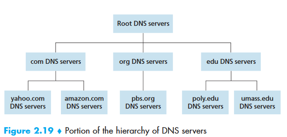

There are 3 types of DNS servers:

- root DNS servers 

  (13,labeled A to M) each is a network of replicated servers

- top-level domain(TLD) DNS servers

  e.g. com,org,net,edu, and gov

  e.g. uk,fr,ca and j

- authoritative DNS servers

  every organization with publicly accessible hosts on the Internet must provide publicly accessible DNS records that map the names of those hosts to IP addresses.

There is another important type of DNS server called the **local DNS server**. Each ISP has a local DNS server, it provides the hosts connected to it the IP addresses of one or more of its DNS servers(typically through DHCP).

When a host make a DNS query, the query is sent to the local DNS server, which acts a proxy, forwarding the query into the DNS server hierarchy.

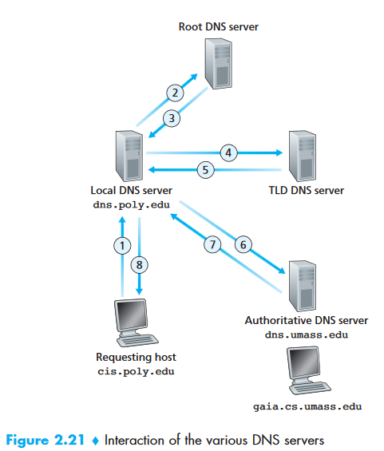

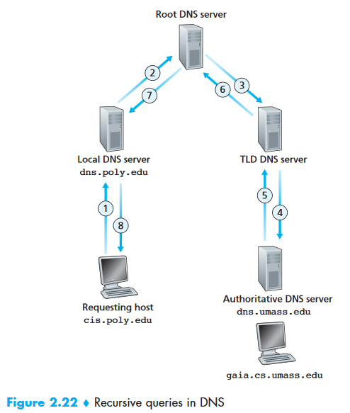

In practice, query from host to local is recursive, rest are iterative.

###### DNS Caching

In a query chain, when a DNS server receives a DNS reply, it can cache the mapping in its local memory. Since the mapping is not permanent, DNS servers discard cached information after a period of time(often 2 days).

###### 2.5.3 DNS Records and Messages

The DNS servers that together implement the DNS distributed database store **resources records(RRs)**, including RRs that provide host-name-to-IP address mappings. Each DNS reply message carry one or more RRs.

A RR is a four -turple that contains the following fields:

```
(Name, Value, Type, TTL)
```

TTL is the time to live of the RR; determine when a resource should be removed from a cache.

The meaning of Name and Value depends on Type:

- Type = A, Name is hostna"
- me, Value is IP address of the hostname
- Type = NS, Name is domain(such as foo.com), Value is the hostname of an authoritative DNS server that knows how to obtain the IP addresses for hosts in the domain. It will be used to route DNS queries further in the query chain.
- Type=CNAME, Value is a canonical hostname for the alias hostname Name 
- Type=MX, Value is the canonical name of a mail server that has an alias hostname Name.

###### DNS Messages

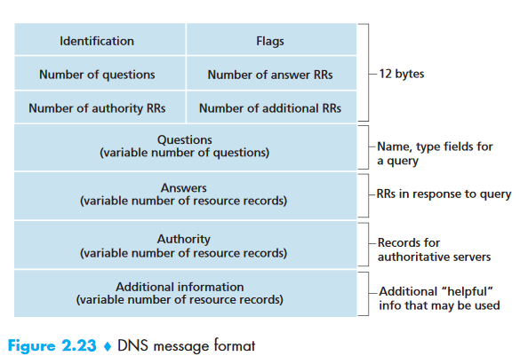

- header section: 12 bytes
  - 16 bit number identifies the query
  - 1 bit  flag indicate query or reply
  - 1 bit authoritative flag is set in a reply message when a DNS server is an authoritative server 
  - 1 bit recursion-desired flag is set when a client desires that the DNS server perform recursion when it does not have the record
  - A 1-bit recursion-available field is set in a reply if the DNS server supports recursion
  - 4 number-of-fields indicate the number of occurrences of the four types of data sections followed the header
- question section
  - a name filed that contains the name that is being queried
  - a type field that indicates the type of question being aksed about he name

- answer section

  resource records of the name that was originally queried

- authority section

  records of other authoritative servers

- additional section

  other helpful records.

How to send DNS query message directly from the host? **nslookup program**

###### Inserting Records into the DNS Database

1. Register the domain name `networkutopia.com` with some registrar
2. provide the registrar with the names and IP addresses of your primary  and  secondary  authoritative  DNS  servers. 
3. or each of these two authoritative DNS servers, the registrar would then make sure that a Type NS and a Type A record are entered into the TLD com servers.
4.  Type A resource record for your Web server `www.networkutopia.com` and  the  Type  MX  resource  record  for  your  mail server `mail.networkutopia.com` are  entered  into  your  authoritative  DNS servers


#### 2.6 Peer-to-Peer Applications

Two suitable P2P applications:

- File distribution

- database distributed over a large community of peers

  Distributed Hash Table (DHT)

#####   2.6.1 P2P File Distribution

###### Scalability of P2P Architectures

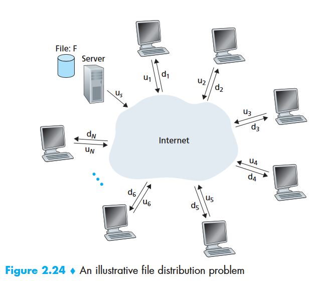

For client-server architecture:

- The server must transmit one copy of the file to each of the N peers. Thus the server must transmit NF bits. Since the server’s upload rate is $u_{s}$ the time to distribute the file must be at least $N F / u_{s}$

- Let $d_{\min }$denote the download rate of the peer with the lowest download rate, that is,$d_{\min }=\min \left\{d_{1}, d_{\mathrm{p}}, \ldots, d_{N}\right\}$. The  peer  with  the  lowest  download  rate  cannot obtain all F bits of the file in less than $F /d_{min }$ seconds. Thus the minimum distribution time is at least $F /d_{min }$ .

Hence, $D_{c s} \geq \max \left\{\frac{N F}{u_{s}}, \frac{F}{d_{\min }}\right\}$

The distribution time increases linearly with the number of peers N

For P2P architecture:

- At the beginning of the distribution, only the server has the file. To get this file into the community of peers, the server must send each bit of the file at least once into its access link. Thus, the minimum distribution time is at least  $F /u_{s}$
- As with the client-server architecture, the peer with the lowest download rate cannot obtain all F bits of the file in less than  $F /d_{min }$ seconds. Thus the minimum distribution time is at least  $F /d_{min }$.

- Finally, observe that the total upload capacity of the system as a whole is equal to the upload rate of the server plus the upload rates of each of the individual peers, that is $u_{\text {total }}=u_{s}+u_{1}+\ldots+u_{N}$. The system must deliver (upload) F bitsto each of the N peers, thus delivering a total of NF bits. Thus, the minimum distribution time is also at least $N F / (u_{s}+u_{1}+\ldots+u_{N})$

Hence, $D_{\mathrm{P} 2 \mathrm{P}} \geq \max \left\{\frac{F}{u_{s}}, \frac{F}{d_{\min }}, \frac{N F}{u_{s}+\sum_{i=1}^{N} u_{i}}\right\}$

.PNG)

###### BitTorrent

BitTorrent is a popular P2P protocol for file distribution.

The collection of all peers participating in the distribution of a particular file is called a *torrent*. Each *torrent* has an infrastructure node called a tracker. When  a  peer  joins  a  torrent,  it  registers  itself  with  the  tracker  and  periodically informs the tracker that it is still in the torrent.

At any given time, each peer will have a subset of chunks from the file, with different peers having different subsets.

Q: How does a peer know which chunk should request first and who to request from?

A: **rarest first** . Determine from  among  the  chunks  she  does  not  have,  the chunks that are the rarest among her neighbors (that is, the chunks that have the fewest repeated copies among her neighbors) and then request those rarest chunks first. In this manner, the rarest chunks get more quickly redistributed, aiming to(roughly) equalize the numbers of copies of each chunk in the torrent.

 Alice gives priority to the neighbors that are currently supplying her data at the *highest rate*. Every 10 seconds, she recalculates the rates and possibly modifies the set of four peers. In BitTorrent lingo, these four peers are said to be **unchoked**. Importantly, every 30 seconds, she also picks one additional neighbor at random and sends it chunks. Let’s call the randomly chosen peer Bob. In BitTorrent lingo, Bob is said to be **optimistically unchoked**.

The effect is that peers capable of uploading at compatible rates tend to find each other.

##### 2.6.2 Distributed Hash Tables(DHTs)