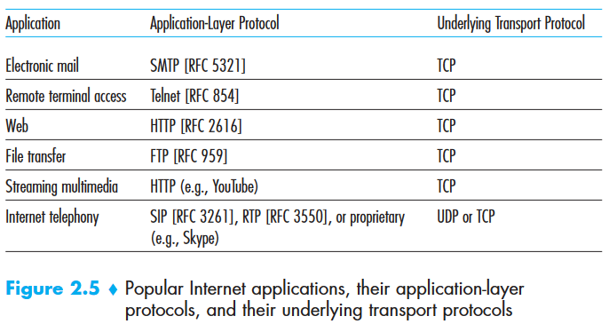
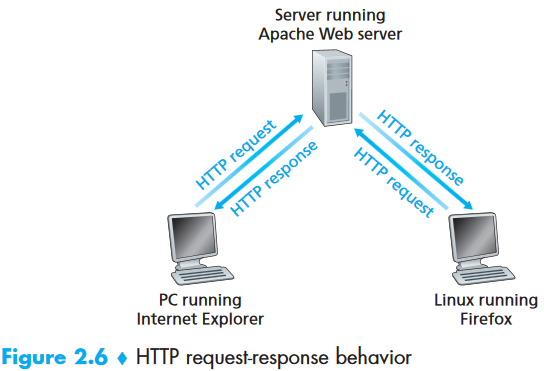

### Application Layer

- Define key application-layer concepts
- Examine several network application in detail
- network application development

#### 2.1 Principles of Network Applications

Core of network application development is writing programs that run on different end systems and communicate with each other over the network.

For example , in Web, there are:

- the browser program running in the user's host
- the Web server program running in the Web server host

Another example, P2P: there is a program in each host that participates in the file-sharing community, the programs in the various hosts may be similar or identical

##### 2.1.1 Network Application Architectures

Distinctly different from an network's architecture.

Two predominant architectural paradigms:

- client-server architecture

  - Server: Always-on host
  - Clients: send  requests to server

  Characteristics:

  - clients do not directly communicate with each other
  - Server has a fixed, well-know address called UP address

  E.g. Web, FTP. Telnet, email

  A single-server host is often incapable of keeping up with all requests from clients. Thus, a **data center**, housing a large number of hosts, is often used to create a powerful virtual server.

- peer-to-peer(P2P) architecture 

  Minimal or no reliance on data centers, by exploiting direct communication between pairs of intermittently connected hosts, name *peers*. 

  E.g. file sharing(BitTorrent), peer assisted download acceleration(Xunlei), Internet Telephony(Skype), and IPTV(PPstream)

  Pros:

  - **Self-scalability**
  - **Cost-effective**

  Challengers:

  - **ISP Friendly**. P2P shift upstream traffic from servers to residential ISPs, while they have been dimensioned for "asymmetrical" bandwidth usage. (Downstream > Upstream)
  - **Security**. Highly distributed and open in nature
  - **Incentives**. Depends on convincing users to volunteer bandwidth, storage, and computation resources to applications.

Some have **hybrid** architectures, combing both client-server and P2P.

e.g. instant messaging applications, servers are used to track IP address of users, but user-to-user messages are sent directly between user hosts

##### 2.1.2 Process Communicating

In OS, it is not programs but **processes** that communicate.

Processes on 2 different end systems communicate with each other by exchanging messages across the computer network.

###### Client and Server Processes

A network application consists of pairs of processes that send messages to each other over a  network.

e.g. With  the  Web,  a browser is a client process and a Web server is a server process. With P2P file-sharing, the peer that is downloading the file is labeled as the client, and the peer that is uploading the file is labeled as the server.

Definition of client and server processes:

> In the context of a communication session between a pair of processes, the process that initiates the communication( that is, initially contacts the other process at the beginning of the session) is labeled as the **client**. The process that waits to be contacted to gebin the session is the **server**.

###### The Interface Between the Process and the Computer Network

A process sends message into, and receives messages from, the network through a software interface called a **socket**.

Socket is the interface between the application layer and the transport layer within a host, also referred as **Application Programming Interface(API)** between the application and the network.

Application develop control everything of the application layer-side but little of transport-layer side. Only exceptions:

1. The choice of transport protocol
2. Fix a few transport-layer parameters such as maximum buffer and minimum segment sizes 

###### Addressing Processes

In order to  identify the receiving process, need:

1. the address of the host
2. an identifier that specifies the receiving process in the destination host

In the Internet, the host is identified by its **IP address**. Due a host might be running many network applications, a destination **port number** is required. e.g. Web server is identified by port number 80, a mail server process(using SMTP protocol) is identified by port number 25. 

##### 2.1.3 Transport Services Available to Applications

Choose transport layer protocol based on 4 dimensions:

- reliable data transfer

- throughput
- timing
- security

###### Reliable Data Transfer

Packet can get lost within a computer network. A packet can overflow a buffer in a router, or can be discarded by a host or router after having some of its bits corrupted.

 If a protocol provides a guaranteed data delivery service, it is said to provide reliable data transfer. One important service that a transport-layer protocol can potentially provide to an application is process-to-process reliable data transfer. Otherwise, some of the data sent by the sending process may never arrive at the receiving process. This might be acceptable for **loss-tolerant applications**.

###### Throughput

Another natural service that a transport-layer protocol could provide, namely, guaranteed available throughput at some specified rate. Applications that have throughput requirements  are said to be **bandwidth-sensitive applications**. There are also **elastic applications**, that can make use of as much, or as little, throughput as happens to be available.

###### Timing

Timing guarantees can come in many shapes and forms.

e.g. Every bit that the sender pumps into the socket arrives at the receiver's socket no more than 100 msec later

###### Security

Finally, a transport-layer protocol can provide an application with one or more security services.

e.g. encrypting all data transmitted by the sending process, and decrypt them at the receiving process. Such a service provide confidentiality between the two processes, even if data is being observed in between.

##### 2.1.4 Transport Services Provided by the Internet

The Internet (and, more generally, TCP/IP networks) makes two transport protocols available to applications,UDP and TCP. When you (as an application developer) create a new network application  for  the  Internet,  one  of  the  first  decisions  you  have  to  make  is whether to use UDP or TCP. 

###### TCP Services

It includes a connection-oriented service and a reliable data transfer service.

- *Connection-oriented service*. TCP has the client and server exchange transport layer control information with each other **before** the application-level messages begin to flow. This so-called handshaking procedure alerts the client and server, allowing them to prepare for an on onslaught of packets,and afterwards a **TCP connection** is said to exist between the sockets of the two processes.

> **SSL(Secure Socket Layer**):TCP-enhanced-with-SSL not only does everything that traditional TCP does but also provides critical process-to-process security services, including encryption, data integrity, and end-point authentication.  When an application uses SSL, the sending process passes cleartext data to the SSL socket; SSL in the sending host then encrypts the data and passes the encrypted data to the TCP socket

Sender -> SSL -> TCP ->...->TCP->SSL->Receiver

- *Reliable data transfer service*. The communicating processes can rely on TCP to deliver all data sent **without error** and in the **proper order**. 

TCP also includes a congestion-control mechanism, a service for the general welfare of the Internet rather than for the direct benefit of the communication processes. It throttles a sending process when the network is congested between sender and receiver. It also attempts to limit each TCP connection to its fair share of network bandwidth.

###### UDP Services

 UDP is a no-frills,lightweight transport protocol, providing minimal services. It is connectionless, no handshake required.  UDP provides no guarantee that the message will ever  reach  the  receiving  process, nor the message will arrive in order. Also no congestion-control mechanism.

###### Services Not Provided by Internet Transport Protocols

Throughput and timing guarantees are bot provided by today's Internet transport protocol. It can often provide satisfactory service to time-sensitive applications, but it cannot provide any timing or throughput guarantees

###### 2.1.5 Application_layer Protocols

We have just learned that network processes communicate with each other by sending messages into sockets. But,

How are these messages structured?

What are the meanings of various fields in the messages?

When do the processes send the messages?

An **application layer protocol** defines how an application's processes, running on different-end systems, pass messages to each other. In particular,

- The types of messages exchanged,e.g., request message and response message
- The syntax of the various message types, such as the fields in the message and how the fields are delineated
- The semantics of the fields, that is the meaning of the information in the fields
- Rules for determining when and how a process send messages and responds to messages

Some application-layer protocols are specified in RFCs and are therefore in the public domain. e.g. HTTP[RFC 2616], if a browser developer follows the rules of the HTTP RFC, the browser will be able to retrieve Web pages from any Web server that has also followed HTTP RFC. Many other application-layer protocols are proprietary and intentionally not available to public.e.g. Skype.

 An application-layer protocol is **only one piece of** a network application.

##### 2.1.6 Network Applications Covered in This Book

- Web
- File transfer
- Electronic mail
- Directory service
- P2P applications

#### 2.2 The Web and HTTP

Web operates *on demand.*

###### 2.2.1 Overview of HTTP

The HyperText Transfer Protocol, is at the heart of the Web. It is defined in [RFC 1945] and [RFC 2616]. HTTP is implemented in two programs: a client program and a server client. Although executing on different end systems, talk to each other by HTTP messages. HTTP defines the structure of these messages and how the client and server exchange the message

A **Web page**(also called a document) consists of objects. An object is simply a file—such as an HTML file, a JPEG image, a Java applet, or a video clip—that is addressable by a single URL. Most Web pages consist of a base **HTML file** and several referenced object. Each URL has two components: the hostname of the server that houses the object and the object’s path name. 

e.g. the URL

> http://www.someSchool.edu/someDepartment/picture.gif has www.someSchool.edu for a host name and  <u>"/someDepartment/picture.gif"</u>  for a path name.

Because **Web browsers**(such as Internet Explorer and Firefox) implement the client side of HTTP, in the context of the Web, we will use the words *browser* and *client* interchangeably. **Web servers**, which implement the server side of HTTP, house Web objects, each addressable by a URL.

HTTP defines how Web clients request Web pages from Web servers and how servers transfer Web pages to clients.

HTTP uses TCP as its underlying transport protocol.

Client initiates a TCP connection with server -> browser and server processes access TCP through socket interfaces -> client and server send HTTP request messages and receives HTTP response messages from its socket interface

HTTP need not worry about lost data or the details of how TCP recovers from loss or reordering of data within the network. 

 HTTP server maintains no information about the clients, HTTP is said to be a **stateless protocol**. (An object sent will be sent again if requested instead of telling the receiver it is already sent).

##### 2.2.2 Non_Persistent and Persistent Connections

Should each request/response pair be sent over a `separate` TCP connection**(Non-Persistent Connections)**, or should all of the requests and their corresponding responses be sent over the `same` TCP connection**( Persistent Connections)**?

###### HTTP with Non-Persistent Connections

