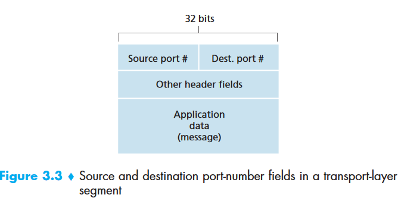

### Transport Layer

- Relationship between the transport and network layers
- how two entities can communicate reliably over a medium that may lose and corrupt data
- controlling  the  transmission  rate  of  transport-layer  entities  in  order  to  avoid,  or recover from, congestion within the network. 

#### 3.1 Introduction and Transport-Layer Services

A transport-layer protocol provides for **logical communication** between application processes running on different hosts.

Application processes use the *logical communication* provided by the transport layer to send messages to each other, *free from the worry of the details* of the physical infrastructure used to carry these messages.

Transport layer protocols are implemented in the **end systems** but not in network routers.

- Receive application layer messages
- Break into small chunks and add transport layer header to each chunk, known as **segments**
- passes the segment to the network layer at the sending end system, segment is encapsulated within a network-layer packet (a **datagram**) 

##### 3.1.1 Relationship between Transport and Network Layers

 Transport-layer  protocol  provides  logical  communication  between *processes running  on  different hosts*.

Network-layer  protocol  provides  logical communication between *hosts*.

Within an end system, a transport protocol moves messages from application processes to the network edge(that is, the network layer) and vice versa, but it doesn’t have any say about how the messages are moved within the network core.

##### 3.1.2 Overview of the Transport Layer in the Internet

- UDP: unreliable, connectionless service 

- TCP: reliable, connection-oriented service

Transport-layer packet is a **segment**. 

The IP service model is a **best-effort delivery service**, also **unreliable service.**

Extending host-to-host delivery to process-to-process delivery is called **transport-layer multiplexing** and **demultiplexing**. 

- UDP services

  - process-to-process  data  deliver

  - error checking

- TCP services(In addition to UDP)

  - congestion control
  - flow control

#### 3.2 Multiplexing and Demultiplexing

Extending  the  host-to-host  delivery  service  provided  by  the  network  layer  to  a process-to-process delivery service for applications running on the hosts.

The transport layer has the responsibility of delivering the data segments from network layer to the appropriate application process running in the host. Reminder that **sockets** are doors through which data passes from the network to the process and through which data passes from the process to the network.

How a receiving host directs an incoming transport-layer segment to the appropriate socket?

- Each segment has a set of fields, and the transport layer examines these fields to identify the receiving socket and then directs the segment to that socket. This is **demultiplexing**
- The job of gathering data chunks at the source host from different sockets, encapsulating each data chunk with header information (that will later be used in demultiplexing) to create segments, and passing the segments to the network layer is called **multiplexing**.

Transport-layer multiplexing requires:

1. sockets have unique identifiers

2. each segment have special fields that indicate the socket to which the segment is to be delivered, which are

   1. source port number field
   2. destination port number field

   

###### Connectionless Multiplexing and Demultiplexing

Typically, the client side of the application lets the trans-port layer **automatically** (and transparently) assign the port number, whereas the server side of the application assigns a **specific** port number.

Suppose  a  process  in  Host  A,  with  UDP port 19157, wants to send a chunk of application data to a process with UDP port 46428 in  Host  B.  What happens is :

1. The  transport  layer  in  Host  A creates  a  transport-layer  segment  that includes the application data, the source port number (19157), the destination port number (46428), and two other values
2. The transport layer then passes the resulting segment  to  the  network  layer.  The  network  layer  encapsulates  the  segment  in  an  IP datagram and makes a best-effort attempt to deliver the segment to the receiving host
3. At Host B, he transport layer at the receiving host examines the destination port number in the segment (46428) and delivers the segment to its socket identified by port 46428

UDP socket is fully identified by a **two-tuple** consisting of a destination IP address and a destination port number.

###### Connection-Oriented  Multiplexing and Demultiplexing

TCP socket is identified by a four-tuple: 

- source IP address
- source port number
- destination IP address
- destination port number