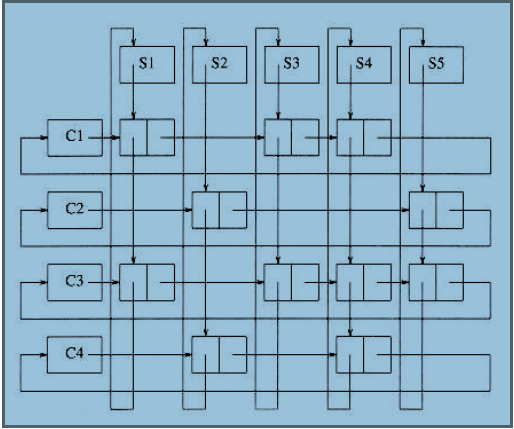

#### Lists, Stacks and Queues

##### Abstract Data Types(ADTs)

**Modularity**:

- easier to debug small routines
- easier for several people to work on a modular program simultaneously
- well-written modular program places certain dependencies in only one routine, making changes easier

An *abstract data type (ADT)* is 

- a set of operations
- mathematical abstractions
- extension of modular design

##### The List ADT

###### SImple Array Implementation of Lists

An array implementation allows

-  print_list and find to be carried out in linear time   
- the find_kth operation takes constant time
- insertion and deletion are expensive  **O(n)**

###### Linked Lists

Each structure contains the element and a pointer to a structure containing its successor, but **not necessarily adjacent in memory**.

With the exception of the find and find_previous routines, all of the operations we have coded take **O(1)** time.

Use **header** 

###### Doubly Linked Lists

- adds to the *space* requirement and also *doubles the cost of insertions and deletions*
- simplifies *deletion*

###### Circularly Linked Lists

have the last cell keep a pointer back to the first

###### Examples (or applications of Linked List)

1. single-variable polynomials

2. sort in linear time

3. keep track of course registration at a university

   ###### 1.The Polynomial ADT

   refer to **Poly_ADT.c** 

   ###### 2. Radix Sort

   steps:

   ​	**1)** Do following for each digit i where i varies from least significant digit to the most significant digit.
   ​	 ..….**a)** Sort input array using counting sort (or any stable sort) according to the i’th digit.

   Given n intergers with max digit k, while b is the base for representing numbers.

   Then overall time complexity = O((n+b)*d)= O((n+b)**logb(k))

   ###### 3. Multilists

   Q: A university with 40,000 students and 2,500 courses needs to be able to generate two types of reports. The first report lists the class registration for each class, and the second report lists, by student, the classes that each student is registered for.

   A: 2D array , too many empty terms, very little meaning data.

   

###### Cursor Implementation of Linked Lists

First, two important terms present in a pointer implementation of linked lists are

1. Data stored in collection of structures. Reach structure contains the data and a pointer to the next structure
2. A new structure can be obtained from the system's global memory by a call to malloc and released by a call to free

The logical way to satisfy condition 1 is to have a global **array of structures**. For any cell in the array, its array index can be used in place of an address.

Simulate condition 2 by allowing the equivalent of malloc and free for cells in the CURSOR_SPACE array.

##### The Stack ADT

###### Stack Model

A stack is a list with the restriction that **inserts and deletes can be performed** in only one position, namely **the end of the list** called the top.

Push: == insert

Pop: deletes the most recently inserted element

LIFO(last in, first out) lists

###### Implementation of Stacks

- Linked List Implementation
- Array Implementation

###### Applications of Stack

- Balancing Symbols

  Make an empty stack and read characters until end of file.

  Open:push into stack

  Close: error if not the corresponding open symbol or empty stack

  End of file: error if stack not empty

- Postfix Expressions

  Does not need to be parenthesized and fewer operations.

  Easy to implement an **Infix to Postfix Conversion**.

- ###### Function Calls

  The information saved is called either an <u>activation record</u> or <u>stack frame</u>

##### The Queue ADT

###### Queue Model

basic operations on a queue are:

**enqueue**: insert elements at the end of the list (rear)

**dequeue**: deletes and returns the element at the start of the list (front)

###### Implementations

- Array Implementation

  - Linear array implementation

  Array *QUEUE[]*; positions *q_front* and *q_rear*;number of elements *q_size*

  **ENQUEUE** an element x: *q_size*++;*q_rear*++;*QUEUE[q_rear]*= x

  **DEQUEUE**: return *QUEUE[q_front]*; *q_size*--;*q_front*++

  - Circular array implementation

    Less memory;more efficient;can insert and remove at any position

- Linked List Implementation

  

