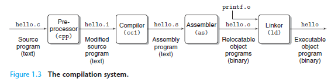

####  1.1 Information Is Bits + Context

####   Fundamental Idea: 

All information in s system -including disk files, programs stored in memory, user data stored in memory, and data transferred across a network - is represented as a bunch of bits.

#### 1.2 Programs Are Translated by Other Programs into Different Forms

Translated into ***<u>low-level machine-language</u>*** instructions and then packaged in a form called an <u>**executable object program**</u> and stored as a binary disk file.

- ###### Preprocessing phase

​        Insert directives that begin with # and generate a new text file

- ###### Compilation phase

  Turn it into statements of machine language instructions

- ###### Assembly phase

  package them in to .o binary files with encoded machine language instructions

- ###### Linking Phase

  Link with precompiled .o files provided by the compiler and generate the executable

#### 1.3 It Pays to Understand How Compilation Systems Work

Why need to Understand how compilation system works?

- ###### Optimizing program performance

- ###### Understanding link-time errors

- ###### Avoiding security holes