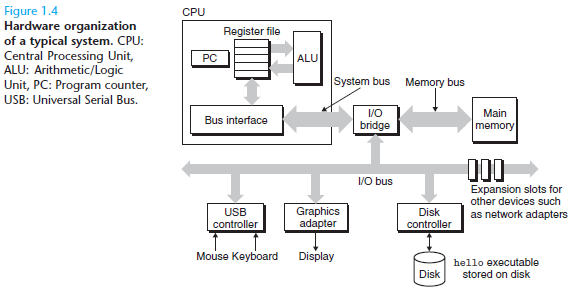
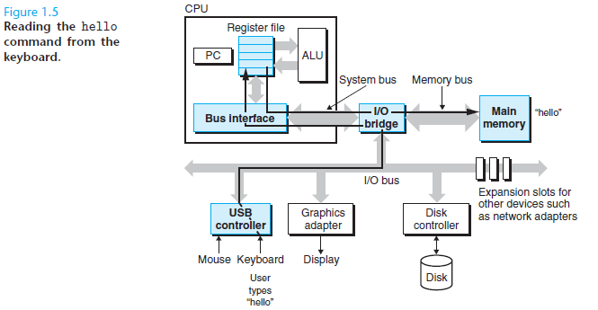
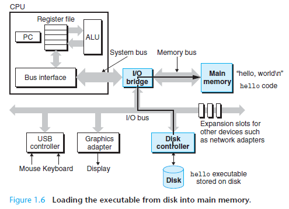
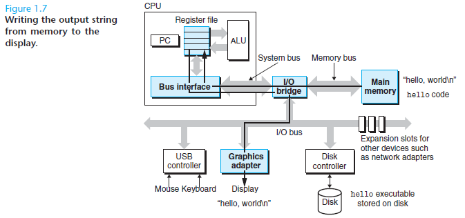
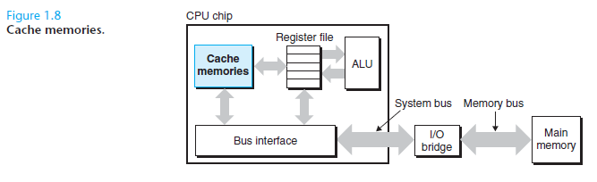
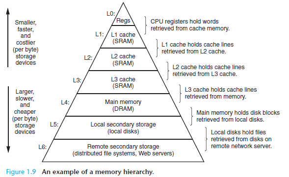

#### 1.4 Processors Read and Interpret Instructions Stored in Memory

##### 1.4.1 Hardware Organization of a System

- **BUS**:  carry bytes of information back and forth between the components

- **I/O Devices**: system’s connection to the external world, connected by
  - Controller : chip-set in device itself or motherboard	
  - Adapter: Card that plugs into a slot on motherboard

- **Main Memory**: Temporary storage device that holds both a program and the data it manipulates while the processor is executing the program

- **processor**: or CPU, interprets the instructions stored in main memory

  Its operation revolves around <u>main memory</u>, the <u>register file</u> and the <u>arithmetic/logic unit(ALU)</u>.

  - **Load** : Copy  a byte/word from main memory to register(**Overwrites**)
  - **Store**: Copy a byte/word from register to main memory(**Overwrites**)
  - **Operate**: Copy contents of two registers to ALU, perform an arithmetic operation and store the results in a register(**Overwrites**)
  - **Jump**: Extract a word from the instruction itself and copy that word into PC(**Overwrites**)

##### 1.4.2 What happens when running "Hello"

​	Process Flow:

**Note:Direct Memory Access(DMA) Above**

#### 1.5 Caches Matter

Hardware Technology: Static Random Memory Access(**SRAM**)

**L1 Cache:** Small size but nearly as fast as register file

**L2 Cache:** Much larger, special bus, around 5 times slower than L1

***To Programmers***: application programmers
who are aware of cache memories can exploit them to improve the performance
of their programs by an order of magnitude

#### 1.6 Storage Devices Form a Hierarchy

***The main idea of a memory hierarchy is that storage at one level serves as a
cache for storage at the next lower level.***

