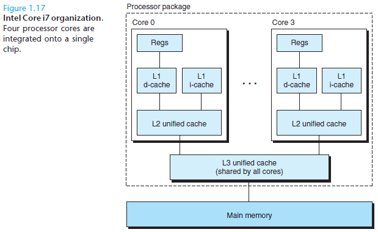

#### 1.7 The Operating System Manages the Hardware

**Purpose of OS: **

- Protect hardware from misuse by runaway applications

- Provide applications with simple and uniform mechanisms for manipulating complicated and often wildly different low-level hardware devices

  

It achieve both goals via the fundamental abstractions shown below:

##### 1.7.1 Processes

A process is the operating system’s abstraction for a running program.

A single CPU can <u>appear</u> to execute multiple processes concurrently by having the
processor <u>switch</u> among them.The operating system performs this interleaving with a mechanism known as **context switching**.

Consider only *<u>uniprocessor system</u>* containing a single CPU for now.

The operating system keeps track of all the state information that the process
needs in order to run. This state, which is known as the ***context***, includes information
such as the <u>current values of the PC</u>, the <u>register</u> file, and the <u>contents</u>
<u>of main memory</u>.

At any point in time, a <u>uniprocessor</u> system can only execute
the code for a **single process**.When the operating system decides to transfer control
from the current process to some new process, it performs a **context switch**
by 

1. saving the context of the current process
2. restoring the context of the new process
3.  passing control to the new process which picks up exactly where it left off

##### 1.7.2 Threads

A process can consist of multiple execution units, called threads,
each running in the context of the process and sharing the same code and global
data.

Thread is an increasingly important programming model due to requirement for **concurrency** in network servers.

Typically Multiple-Threading **>** Multiple-process

##### 1.7.3 Virtual Memory

Virtual memory is an <u>**abstraction**</u> that provides each process with the <u>illusion that it</u>
<u>has exclusive use of the main memory</u>.

The virtual address space seen by each process consists of a number of welldefined
areas, each with a specific purpose.

- **Program code and data**: Initialized directly from the contents of an executable object file.

  Code begins at the <u>same fixed address</u> for all processes,followed by data locations that corresponds to global C variable. (**Fixed in Size**)

- **Heap**: Code and Data areas are followed immediately by the run-time heap. Its size **expands and contracts dynamically at run-time** as a result to calls to C standard library routines such as *malloc* and *free*

- **Shared Libraries**: Near the middle of the address space is an area that holds the
  code and data for shared libraries such as the C standard library and the math
  library.

- **Stack**: At the top of the user’s virtual address space is the *user stack* that
  the compiler uses to implement function calls. Its size also **expands and contracts dynamically**.

  Particularly:   call a function--> the stack grows, returns from a function --> the stack contracts

- **Kernel virtual memory**:The kernel is the part of the operating system that is
  always resident in memory. Not readable nor writable to application programs

*Basic Idea for virtual memory to work: Store the contents of a process's virtual memory on disk, and then use the main memory as a cache for the disk.*

##### 1.7.4 Files

A file is **simply a sequence of bytes**. Every I/O device including networks is modeled as a file, and all input and output in the system is performed by reading and writing files.

This simple and elegant notion of a file is nonetheless very powerful because
it provides applications with a **uniform view** of all of the varied I/O devices that
might be contained in the system.

#### 1.8 Systems Communicate with Other Systems Using Networks

From the point of view of an individual system, the network can be viewed as just another I/O device, as shown below.

Below  exchange between clients and servers is typical of all network applications.

#### 1.9 Important Themes

Important take away:  A system is more than just hardware, but collection of intertwined hardware and systems software that must cooperate in order to achieve the ultimate goal of running application programs.

##### 1.9.1 Concurrency and Parallelism

Two demands have been constant forces driving improvements: we want them to **do more**, and we want them to **run faster**.

**Concurrency**:general concept of a system with multiple, simultaneous activities

**Parallelism**: use of concurrency to make a system run faster, can be exploited through multiple levels of abstraction

- **Thread-Level Concurrency**

Traditionally, this concurrent execution was only simulated, by having a single computer rapidly switch among its executing processes.(SO NOT REALLY SIMULTANEOUS?)

Recently, most actual computing was done by a single processor, even if that processor had to switch among multiple tasks. This configuration is known as a *<u>uniprocessor</u>* system.

*<u>multiprocessor system</u>*: a system consisting of multiple processors all under the control of a single operating system kernel

**Hyperthreading**, sometimes called *simultaneous multi-threading*, is a technique
that allows a single CPU to execute multiple flows of control.It involves
having multiple copies of some of the CPU hardware, such as <u>*program counters*</u>
<u>*and register files*</u>, while having only single copies of other parts of the hardware,
such as the *<u>units that perform floating-point arithmetic</u>*.

It can decides which of its threads to execute on a cycle-by-cycle basis.

How hyper-threading improve system performance:

- Reduces the need to simulate concurrency when performing multiple tasks.
- run a single application program faster, but **only if that program is expressed in terms of multiple threads** that can effectively execute in parallel. (Programmers's duty)

- **Instruction-Level Parallelism**

At a much **lower level of abstraction**,modern processors can execute multiple instructions at one time,a property known as *instruction-level parallelism*.

Processors that can sustain execution rates faster than one instruction per cycle are known as *superscalar processors*.

- **Single-Instruction, Multiple_data(SIMD) Parallelism**

At **lowest level**, modern processors have special hardware that allows a single instruction to cause multiple operations to be performed in parallel, a mode known as *single-instruction, multiple-data*, or “SIMD” parallelism.

Mostly used to mostly to speed up applications that process image, sound, and video data.

Method for programmers:

Write programs using special vector data types supported in compilers such as GCC

##### 1.9.2 The Importance of Abstractions in Computer Systems

**MOST IMPORTANT!!!**

e.g. Having APIs allow programmers to use the code without having to delve into its inner workings.

Different programming languages provide different forms and levels of support for abstraction, such as Java class declarations and C function prototypes.

Processor side: the *<u>instruction set architecture</u>* provides an abstraction of the actual processor hardware

OS side: shown in Figure 1.18

#### 1.10 Summary

A computer system consists of hardware and systems software that cooperate to run application programs. Information inside the computer is represented as groups of bits that are interpreted in different ways, depending on the context. Programs are translated by other programs into different forms, beginning as ASCII text and then translated by compilers and linkers into binary executable files.

Processors read and interpret binary instructions that are stored in main memory. Since computers spend most of their time copying data between memory, I/O devices, and the CPU registers, the storage devices in a system are arranged in a hierarchy, with the CPU registers at the top, followed by multiple levels of hardware cache memories, DRAM main memory, and disk storage. Storage devices that are higher in the hierarchy are faster and more costly per bit than
those lower in the hierarchy. Storage devices that are higher in the hierarchy serve as caches for devices that are lower in the hierarchy. Programmers can optimize the performance of their C programs by understanding and exploiting the memory hierarchy.

The operating system kernel serves as an intermediary between the application and the hardware. It provides three fundamental abstractions: (1) Files are abstractions for I/O devices. (2) Virtual memory is an abstraction for both main memory and disks. (3) Processes are abstractions for the processor, main memory, and I/O devices.

Finally, networks provide ways for computer systems to communicate with one another. From the viewpoint of a particular system, the network is just another I/O device.

