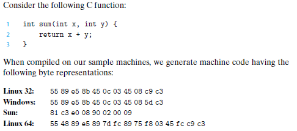

#### 2.Representing and Manipulating Information

Three most important representations of number:

- *<u>Unsigned</u>* encodings are based on traditional binary notation, representing numbers greater than or equal to 0

- *<u>Two's-Complement</u>* encodings are the most common way to represent <u>signed</u> integers, that is, numbers that may be either positive or negative.

- *<u>Floating-point</u>* encodings are a base-two version of scientific notation for representing real numbers.

Computer representations use a limited number of bits to encode a number, and hence some operations can overflow when the results are too large to be represented.

e.g. 200 * 300 * 400 * 500 yields -884,901,888 when using a 32-bit representation of data type int, nevertheless, integer computer arithmetic **satisfies** many of the familiar properties of **true integer arithmetic**.

Floating-point arithmetic has altogether different mathematical properties. Overflow will yield the special value +∞, it is not associative, due to the **finite precision** of the representation.

e.g. (3.14+1e20)-1e20 = 0.0

------

*integer representations* can encode a comparatively <u>small range of values</u>, but do so <u>precisely</u>

*floating-point representations* can encode a <u>wide range of values</u>, but only <u>approximately</u>.

------

**C standards** for numeric representations and operations are designed to allow a wide range of implementations.

**Java standards** is quite specific on the formats and encodings of data. 

##### 2.1 Information Storage

Rather than accessing individual bits in memory, most computers use blocks
of eight bits, or **bytes**, as the *<u>smallest addressable unit of memory</u>*.

Machine level program views memory as <u>*a very large array of bytes*</u>, referred to as **virtual memory**. Every byte of memory is identified by a unique number, known as its
<u>*address</u>*, and the set of all possible addresses is known as the **virtual address space**.

###### 2.1.1 Hexadecimal Notation

Binary notation is too verbose, while with decimal notation, it is tedious to convert to and from bit patterns.

**KNOWN, NO NEED TO STUDY**

###### 2.1.2 Words

Every computer has a word size, indicating the nominal size of integer and pointer data.

32-bit limits the virtual address space to 4 gigabytes (written 4 GB)

###### 2.1.3 Data Sizes

 of C numeric data types.PNG)

Programmers should strive to make their programs portable across different machines and compilers.

One aspect of portability is to make the program i*<u>nsensitive to the exact sizes of the different data types</u>*.

###### 2.1.4 Addressing and Byte Ordering

Two conventions: 

- What the address of an object will be

- How the bytes are ordered in memory

A multi-byte object is stored as a **contiguous sequence of bytes**, with the address of the object given by the **smallest address of the bytes used**. e.g. suppose a variable x of type int has address 0x100, that is, the value of the address expression &x is 0x100. Then the 4 bytes of x would be stored
in memory locations 0x100, 0x101, 0x102, and 0x103.

The  convention—where the least significant byte comes first—is referred to as **little endian**.(followed by most Intel-compatible machines)

The convention—where the most significant byte comes first—is referred to as big endian. (followed by most machines from IBM and Sun Microsystems)

Many recent microprocessors are **bi-endian**, meaning that they can be configured to operate as either little- or big-endian machines.

For most **application programmers**, the byte orderings used by their machines are totally **invisible**,except when:

- binary data are communicated over a network between different machines

- looking at the byte sequences representing integer data

- programs are written that circumvent the normal type system

The different machine/operating system configurations use different conventions for storage allocation.

###### 2.1.5 Representing Strings

A string in C is encoded by an array of characters terminated by the null (having value 0) character.Text data is <u>more platform-independent</u> than binary data.

###### 2.1.6 Representing Code

 

A fundamental concept of computer systems is that a program, from the perspective of the machine, is simply a sequence of bytes.

###### 2.1.7 Introduction to boolean Algebra

We can extend the four Boolean operations to also operate on bit vectors, strings of zeros and ones of some fixed length w. One useful application of bit vectors is to represent finite sets.   

------

e.g. set ai = 1if and only if i ∈ A

​	bit vector a = [01101001] encodes the setA = {0, 3, 5, 6}

​       bit vector b = [01010101] encodes the setA = {0, 2, 4, 6}

Then a & b yields bit vector [01000001], while A ∩ B = {0, 6}.  

------

###### 2.1.8 Bit-Level operations in C

Boolean operations can be applied to any “integral” data type, that is, one declared as type char or int, with or without qualifiers such as short, long, long long, or unsigned.

One common use of bit-level operations is to implement masking operations.

e.g.The bit-level operation x **& 0xFF** yields a value consisting of the **least significant byte** of x, but with all other bytes set to 0.

###### 2.1.9 Logical Operations in C 

C also provides a set of logical operators ||, &&, and !, which correspond to the **Or, And, and Not** operations of logic.The logical operations treat any <u>nonzero argument as representing True</u> and <u>argument 0 as representing False</u>.

###### 2.1.10 Shift Operations in C

**x << k**  : x is shifted k bits to the left, dropping off the k most significant bits and filling the right end with k eros

**x>>k** : *Logical* : filling the left end with k zeros

​	    *Arithmetic*:  filling the left end with k repetitions of the most significant bits

<u>e.g.</u>

##### 2.2 Integer Representation

###### 2.2.1 Integral Data Types

###### 2.2.2 Unsigned Encodings

The unsigned binary representation has the important property that every number between 0 and 2^(w − 1)has a <u>unique encoding</u> as a w-bit value. Mathematically *<u>bijection</u>*.

###### 2.2.3 Two's -Compliment Encodings

$B 2 T_{w}(\vec{x}) \doteq-x_{w-1} 2^{w-1}+\sum_{i=0}^{w-2} x_{i} 2^{i}$

interpreting the most significant bit of the word to have negative weight, also *<u>bijection</u>*

One's-Compliment and Sign Magnitude does not have *<u>bijection</u>*,

###### 2.2.4 Conversion between signed and unsigned

$T 2 U_{w}(x)=\left\{\begin{array}{cc}{x+2^{w},} & {x<0} \\ {x,} & {x \geq 0}\end{array}\right.$

$U 2 T_{w}(u)=\left\{\begin{array}{cc}{u,} & {u<2^{w-1}} \\ {u-2^{w},} & {u \geq 2^{w-1}}\end{array}\right.$

###### 2.25 Signed vs Unsigned in C

###### 2.2.6 Expanding the Bit Representation of a Number

###### 2.2.7 Truncating Numbers

Truncation for unsigned numbers:$B 2 U_{k}\left(\left[x_{k-1}, x_{k-2}, \ldots, x_{0}\right]\right)=B 2 U_{w}\left(\left|x_{w-1}, x_{w-2}, \ldots, x_{0}\right|\right) \bmod 2^{k}$

Truncation for two's compliment:

$B 2 T_{k}\left(\left[x_{k-1}, x_{k-2}, \ldots, x_{0}\right]\right)=U 2 T_{k}\left(B 2 U_{w}\left(\left[x_{w-1}, x_{w-2}, \ldots, x_{0}\right]\right) \bmod 2^{k}\right)$

##### 2.3 Integer Arithmetic

##### 2.4 Floating Point

##### 2.5 Summary